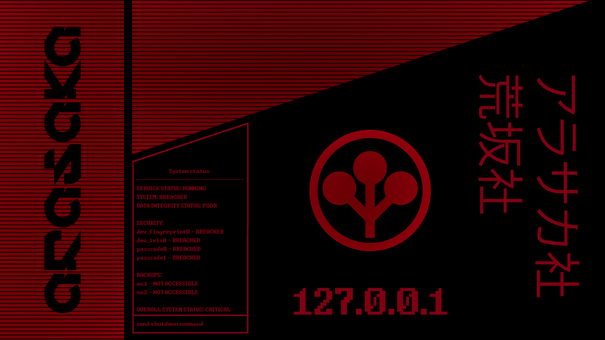

# Modern Pi Desktop Restoration



This repository contains a complete backup of custom configurations, dotfiles, and scripts designed to transform the default Raspberry Pi OS desktop into a beautiful, modern, and highly functional experience.

## ✨ Features
* **Custom Control Center:** A Python GTK-based control panel (accessible via the top panel) that manages Wi-Fi connections, network traffic stats, and power options.
* **Rofi App Launcher:** Replaces the default application menu with a stunning, large-icon Rofi launcher (`ubuntu-style.rasi`), mapped to your Super (Win) key.
* **Custom UI & Themes:** Pre-configured settings for Openbox, Labwc, GTK 3.0, and `wf-panel-pi` to create a cohesive modern look.
* **Icon Packs:** Automatically applies the crisp `Papirus` icon theme across the system.
* **Wallpapers:** Includes custom desktop backgrounds.

## 🚀 Installation
You can easily restore this entire environment on a fresh Raspberry Pi OS installation by running the included setup script. The script will automatically install missing dependencies, copy all dotfiles to their correct locations, and restart the desktop environment.

```bash
cd ~/pi-backup
chmod +x install.sh
./install.sh
```


## 📂 Repository Structure
* `bin/` - Custom Python and shell scripts (including `rofi-control-center.py`).
* `config/` - Configuration files for Rofi, Wayfire panel (`wf-panel-pi`), Openbox, Labwc, PCManFM, GTK 3.0, and `xsettingsd`.
* `icons/` & `local/` - Custom system icons (Papirus overlays).
* `Pictures/` - Custom desktop wallpapers.
* `install.sh` - The one-click restoration script.
